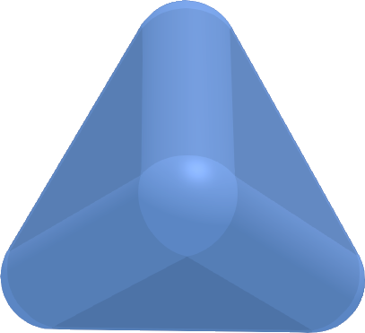

# ConvexSpheropolyhedronVolume
Small Python notebook providing a method to calculate the volume of a 3D convex spheropolyhedron.

## Spherowhat now? Why? ##

Spheropolyhedra are the Minkowski sum of a polyhedron and a sphere. Minkowski sums are basically math with geometric shapes. The sum of two shapes yields something that's a little bit of both. As an example, here's a picture of a spherotetrahedron.

*Convex* spheropolyhedra have nice mathematical properties that lend themselves well to collision detection algorithms such as  Gilbert-Johnson-Keerthi (GJK). However, I couldn't find any analytical formulae for calculating their volume, nor a simple algorithm, so I coded one myself. 

## Algorithm outline ##

The idea is quite simple. Any polyhedron is composed of vertices, edges and faces. A *sphero*polyhedron with rounding radius *R* is the shape you get at a constant distance *R* away from this polyhedron. So, to calculate the volume of this new shape, what we do is:

- Calculate the volume of sphere segments of radius *R* around all vertices.
- Calculate the volume of cylinder segments of radius *R* around all edges.
- Calculate the extra volume of moving all faces outward by *R*.

The only hard parts are knowing how much of each sphere/cylinder to take, which takes a little more math, and of course dealing with edge cases. The Python file itself has step-by-step comments, so I won't go into all details here.
